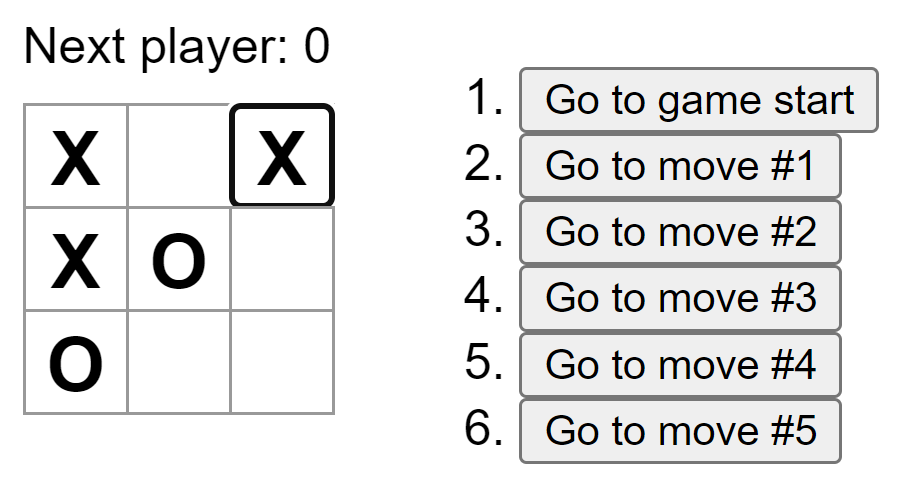

#Tic-tac-toe React app

A very basic game of Tic-tac-toe made in React following the [tutorial](https://react.dev/learn/tutorial-tic-tac-toe).\

This project was bootstrapped with [Create React App](https://github.com/facebook/create-react-app).\

In the project directory, you can run:

### `npm start`
Runs the app in the development mode.\
Open [http://localhost:3000](http://localhost:3000) to view it in your browser.\
\
